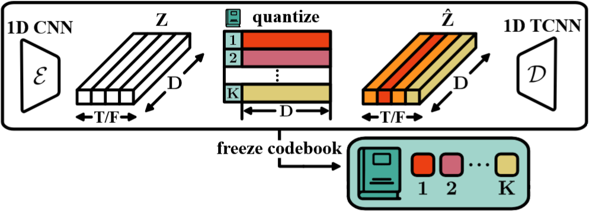

# Svara Tokenizer

Domain-specific time series tokenizer for svara representation learning in Carnatic music transcription and analysis.

## Methodology

We train a VQ-VAE model to reconstruct time series by quantizing the latent representation (tokens).
For more details, refer to the [TOTEM paper](https://arxiv.org/abs/2402.16412).
These tokens can be used for downstream tasks such as classification, imputation, and more.



## Reproduce

Install dependencies:

```bash
pip install -r requirements.txt
```

Run the script:
```bash
python train_vqvae.py --epoch EPOCH --batch_size BATCH_SIZE --run_id RUN_ID
```

## Reference
```bibtex
@misc{talukder2025totemtokenizedtimeseries,
      title={TOTEM: TOkenized Time Series EMbeddings for General Time Series Analysis},
      author={Sabera Talukder and Yisong Yue and Georgia Gkioxari},
      year={2025},
      eprint={2402.16412},
      archivePrefix={arXiv},
      primaryClass={cs.LG},
      url={https://arxiv.org/abs/2402.16412},
}
```
